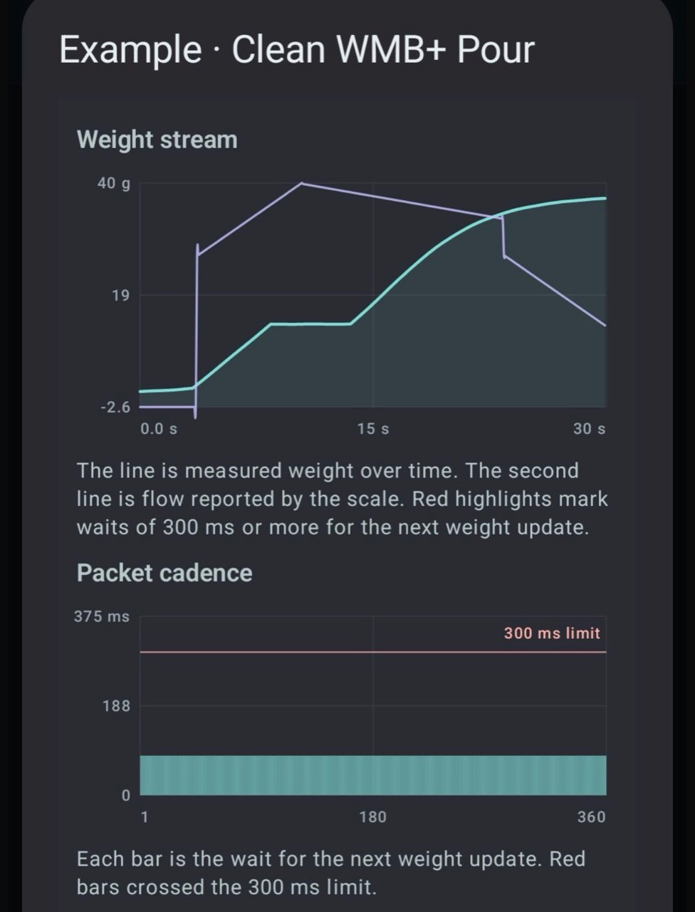

# ScaleBench

<p align="center">
  
</p>

ScaleBench is an open Bluetooth coffee-scale analyzer for iPhone, iPad, macOS Catalyst, and Android. It records BLE notifications at callback time, preserves raw packets, parses them into a canonical weight stream, computes mode-specific quality results, and exports the evidence as JSON.

ScaleBench is a diagnostic benchmark, not a brew log. Its purpose is to compare scale hardware and protocols under controlled procedures.

<p align="center">
  
</p>

For recording procedures, scoring explanations, diagnostics, and troubleshooting, see [HELP.md](HELP.md).

## Current app status

- **iPhone and iPad**: live BLE recording, Standard v1 scoring, charts, packet inspection, saved recordings, JSON import/export, score explanation, scorecard export, and first-run examples.
- **macOS Catalyst**: the same recording and analysis workflow, plus Device Utility for cabled maintenance experiments.
- **Android**: live BLE recording, Standard v1 scoring, dark/light theme, richer diagnostic overlays, packet inspection, saved-recording details, JSON import/export through the Android file picker, scorecard sharing, Nordic DFU support, USB device detection, and first-run examples.
- Saved recordings use a shared recording format. Exports from iOS/macOS can be imported by Android and Android exports can be imported by iOS/macOS.

## Requirements

- iOS/iPadOS 17 or newer
- macOS 14 or newer through Mac Catalyst
- Android 8.0 (API 26) or newer
- Bluetooth permission and a supported scale for live recording

## Downloads

Published builds are attached to [GitHub Releases](https://github.com/danielfcurrie-alt/ScaleBench/releases):

- **macOS**: download `ScaleBench-1.0.0-macOS.zip`, expand it, and move `ScaleBench.app` to Applications. The GitHub build is ad hoc signed but not yet Apple-notarized; right-click the app and choose **Open**, or approve it under **System Settings > Privacy & Security** if Gatekeeper asks.
- **Android**: download the release-signed APK and allow installation from your browser or file manager when Android asks.
- **iOS/iPadOS**: download `ScaleBench-1.0.0-iOS-unsigned.ipa` for self-signing, or build the `v1.0.0` source tag in Xcode with your own signing team. The IPA is not directly installable: sign it with your own Apple ID using a third-party tool such as [Sideloadly](https://sideloadly.io/) or [AltStore Classic](https://faq.altstore.io/), then install it with Developer Mode enabled. With a free Personal Team, Apple limits the provisioning profile to seven days, after which the app must be refreshed or reinstalled. See [Apple's Personal Team documentation](https://developer.apple.com/help/account/basics/about-your-developer-account). TestFlight will be the normal public installation route when available.

Every release also includes SHA-256 checksums. GitHub automatically provides source archives for the exact tagged revision.

## Supported protocols

| Family | Parsed data |
| --- | --- |
| WeighMyBru / WeighMyBru+ | weight; extended packets may include timestamp, sequence, flow, battery, status, and diagnostics |
| BooKoo Standard / Mini / Ultra | weight, timestamp, flow, battery, and protocol-specific status fields |
| Acaia | weight |
| Decent / Espressi | weight and shot timer when present |
| DiFluid Microbalance / Ti | weight, free-running device timestamp, flow, and battery |
| Eureka Precisa / Solo Barista / LSJ | weight |
| Felicita | weight |
| Futula / LFSmart / Lefu | weight |
| Skale2 | weight |
| Timemore Black Mirror Dot | weight, battery, and CRC rejection diagnostics |

BooKoo Mini and Ultra support follows the public [OpenSourceBooKoo](https://github.com/patrlean/OpenSourceBooKoo) protocol documentation.

## ScaleBench Standard v1

The public benchmark is **ScaleBench Standard v1**, identified in exports as `standard-1.0.0`. There is one public scoring contract; custom weighted profiles are not part of Standard v1.

Standard v1 is mode-aware. It does not produce one blended score that mixes unrelated behaviors.

Delivery applies only to **Shot / Pour** and **Transport Stress**:

```text
Delivery = round(100 x coverage x purity)
```

- **Coverage** is the fraction of complete 50 ms slots containing at least one usable weight frame. A clean 20 Hz stream reaches 100% coverage; faster streams saturate rather than earning bonus points.
- **Purity** is usable weight frames divided by all relevant weight frames. Parse failures, out-of-order sequence values, stale free-running timestamps, isolated implausible spikes, and avoidable duplicates each have a fixed classification order. Sustained Shot / Pour motion is not treated as packet corruption.
- Multiplication makes defects compound. Half coverage and half purity produce 25, not 50 or 75.

Checksums, sequence numbers, and device clocks do not earn points merely for existing. They make additional defect classes observable. Available checks also respect the selected mode: Transport Stress deliberately disables weight-physics and duplicate checks. When every class is not checked, Delivery is rendered as an upper bound such as `<=100`, beside a label such as `3 of 5 available`.

**Idle Stability** is a separate score based on detrended residual noise and drift. **Step Response** reports rise time, settling time, and overshoot without a 0-100 score. These domains are never combined into a weighted overall score.

The normative formulas, constants, classification order, and golden vectors are in [scoring/SCORING-SPEC.md](scoring/SCORING-SPEC.md).

## Recording procedures

| Mode | Official minimum | Procedure | Result |
| --- | ---: | --- | --- |
| Shot / Pour | 20 s | Tare and settle before Start; stop before removing the vessel | Delivery |
| Transport Stress | 120 s | Intentionally stress range/interference; disconnects are recorded but allowed | Delivery |
| Idle Stability | 60 s | Leave the scale untouched; the first 5 s are discarded | Idle Stability |
| Step Response | 10 s | Wait at least 2 s, add at least 5 g once, then hold through the final window | Metrics only |
| Tare Latency | 5 s | Record around a tare action | Metrics only |
| Battery Logging | 60 s | Capture exposed battery telemetry | Telemetry only |

The app captures monotonic start and stop boundaries when the user acts. Only frames in the half-open interval `[start, end)` are scored, so startup silence, trailing outages, and disconnect boundaries remain visible. Recordings without authoritative boundaries retain diagnostics but do not receive an official score.

Other validity gates include minimum usable-frame counts and mode-specific baseline/final-window requirements. A disconnect invalidates normal modes; Transport Stress is the deliberate exception. Every official capture must remain in the foreground. The apps keep the screen awake, export app background/foreground events, and withhold an official result if the app leaves the foreground so mobile background scheduling cannot silently change the measurement.

## Comparing results

Always compare:

- the same recording mode and procedure
- the same platform family
- the Delivery value together with available protocol checks
- the exported `scoringModelVersion`

iOS and Android BLE connection controls differ, so their Delivery results are different measurement conditions and should not be ranked directly against one another. Android official captures request high connection priority and an MTU of 247; Apple controls connection parameters through CoreBluetooth.

## Exports

JSON exports include platform/app build identity, raw packets, decoded packet field maps, parsed samples, explicit recording boundaries, disconnect/reconnect and app-state events, link setup, protocol scoring capabilities, Standard v1 validity, frame classifications, mode-specific results, and diagnostics. The schema version describes the container; `scoringModelVersion` identifies the mathematics.

Saved recordings are recalculated from stored raw packets and samples whenever they are loaded or exported. This keeps captures in the current shared format usable while Standard v1 is still being tuned, without confusing container schema changes with scoring math changes.

The visible JSON export buttons write the shared recording JSON. The app also has an internal official analysis/scorecard payload model used by the scorecard and cross-platform analysis tests; this is separate from the normal recording export.

Scorecards are generated only for valid scored modes. They show the platform and, for Delivery, coverage, purity, and Protocol detail. Metrics-only and invalid recordings remain exportable as JSON but cannot produce an official 0-100 scorecard.

## Recordings library

The saved-recordings view is the main comparison surface on every platform. It is collapsible and can be viewed by:

- **Date**: newest recordings first
- **Score**: best comparable Standard v1 result first
- **Protocol**: grouped by scale/protocol family, with the best full-detail result highlighted
- **Mode**: grouped by Shot / Pour, Idle Stability, Step Response, and other test modes

Three synthetic examples are seeded automatically on first launch when the local recordings library is empty:

- `Example · Clean WMB+ Pour`
- `Example · Legacy WMB Pour`
- `Example · Noisy Solo Barista Pour`

If a user already has saved recordings, examples are not inserted automatically, but the app keeps an **Examples** / **Add examples** action available.

Saved detail screens include charts, score explanation, deduction evidence, protocol comparison context, and raw packet inspection. Selectable, color-keyed hex connects raw byte ranges to parser-decoded fields such as weight, timestamp, flow, battery, sequence, and checksum.

The shared chart-analysis model also reports three non-scoring signal diagnostics when the source data supports them: median reported-flow error and timing against a centered 1-second weight derivative; free-running device-clock drift for BooKoo-family and WMB+ packets; and average weight frames per occupied 50 ms scoring slot. Decent's shot timer is deliberately excluded from clock-drift analysis.

## Device Utility

Device Utility, or DU, is not a scoring mode. It is an operational surface for connected-device maintenance.

- Android can start classic Nordic nRF5 Secure/Legacy DFU from a ZIP package using Nordic's Android DFU library.
- SMP/McuManager devices are detected by advertised service UUID, but update is not wired in yet.
- Device Utility is not exposed in the iOS/iPadOS app. Apple OTA update work should use NordicDFU or the Nordic iOS McuManager package later, after the target bootloader is confirmed.
- macOS Catalyst exposes Device Utility below the normal recordings workflow. It scans for cabled USB serial ports and can run ESP32 4 MB flash backup and app-binary flashing through local esptool, with flash blocked until a backup succeeds. It also shows command templates for Nordic serial DFU, unlocked Nordic debug readback, USB DFU, and ESP serial workflows.
- Android detects attached USB devices and includes them in DU reports. Android ESP32 backup/flash needs a native `esp-serial-flasher` bridge before destructive operations are enabled.
- "Backup" means exporting a device utility report by default. Full firmware image backup requires a cabled/debug/bootloader readback path and is not assumed.

## Development builds

Build requirements:

- Xcode 26 or newer for the Apple project
- Android Studio with Android SDK 36 and JDK 17 for the Android project
- Python 3 only for shared-contract validation and scoring-vector generation

### iPhone, iPad, and Mac

Open `ScaleBench.xcodeproj`, select the `ScaleBench` scheme, then choose either an attached iPhone/iPad or **My Mac (Mac Catalyst)** and press Run. Select your own signing team for a physical iOS device. If Xcode reports that the bundle identifier is unavailable, replace `app.scalebench.ScaleBench` with a unique reverse-DNS identifier owned by your team.

Compile an unsigned iOS device build from the command line:

```sh
xcodebuild -project ScaleBench.xcodeproj -scheme ScaleBench \
  -configuration Debug -destination 'generic/platform=iOS' \
  CODE_SIGNING_ALLOWED=NO build
```

Compile a Mac Catalyst build:

```sh
xcodebuild -project ScaleBench.xcodeproj -scheme ScaleBench \
  -configuration Debug \
  -destination 'platform=macOS,variant=Mac Catalyst' build
```

### Android

Open `ScaleBenchAndroid` in Android Studio, or build the Debug APK from the repository root:

```sh
./ScaleBenchAndroid/gradlew -p ScaleBenchAndroid :app:assembleDebug
```

The APK is written to `ScaleBenchAndroid/app/build/outputs/apk/debug/app-debug.apk`. Install it on an attached, authorized device with:

```sh
adb install -r ScaleBenchAndroid/app/build/outputs/apk/debug/app-debug.apk
```

### Maintainer convenience scripts

The scripts below build from this checkout and install local Debug builds. The Apple scripts discover an available development identity and paired iPhone; `SCALEBENCH_CODESIGN_IDENTITY` and `SCALEBENCH_IOS_DEVICE_ID` override discovery when needed. Other contributors can also use Xcode as described above.

```sh
./scripts/build-android-install.sh
./scripts/build-ios-install.sh [device-id]
./scripts/build-mac.sh
```

### Verification

Android scoring and shared-contract conformance:

```sh
./ScaleBenchAndroid/scripts/run_core_smoke_tests.sh
```

Shared JSON contracts:

```sh
python3 -m pip install -r requirements-dev.txt
python3 scripts/validate_json_contracts.py
```

The contract check validates iOS and Android recording fixtures, the official scorecard, the official analysis payload, and its nested chart analysis. GitHub Actions runs it for every change; Android runs its core suite on Linux and Swift runs the same scoring and signal-diagnostic vectors on macOS.

Golden fixtures are generated deterministically from the dependency-free reference implementation:

```sh
python3 scoring/reference/generate_vectors.py
```

Public release assets use one matching version number and are built from the tagged commit:

- an ad hoc-signed macOS Catalyst app packaged as a ZIP, clearly identified as not yet notarized
- a release-signed Android APK
- an unsigned iOS IPA for users who will self-sign it with their own Apple ID
- a `SHA256SUMS.txt` file covering all uploaded binaries

Self-signing tools are third-party software and are not affiliated with ScaleBench. The source-build route through Xcode remains available from the same release tag.

## License

ScaleBench is available under the MIT License. See [LICENSE](LICENSE).

## Privacy

ScaleBench stores recordings and diagnostics locally unless the user exports or shares them. See [PRIVACY.md](PRIVACY.md).
